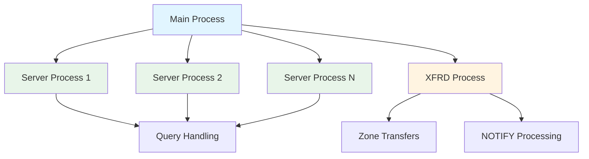

# Introduction to NSD

The NLnet Labs Name Server Daemon (NSD) is an authoritative DNS name server developed for operations in environments where speed, reliability, stability, and security are of critical importance.

## What is NSD?

NSD is a complete implementation of an authoritative DNS nameserver. Unlike recursive resolvers that cache DNS queries, NSD serves authoritative answers for zones it hosts. When a query comes in, NSD answers directly from its zone data with extremely high performance.

<Note>
NSD is designed with a pure philosophy that prioritizes raw performance. If you serve hundreds of thousands or even millions of queries per second, NSD is a leading implementation worldwide.
</Note>

## Key Features

<CardGroup cols={2}>
  <Card title="Exceptional Performance" icon="gauge-high">
    Built for raw speed with optimized data structures and minimal overhead. Handles millions of queries per second efficiently.
  </Card>
  
  <Card title="IPv6 Support" icon="network-wired">
    Full native IPv6 support alongside IPv4, with dual-stack operation out of the box.
  </Card>
  
  <Card title="DNSSEC Ready" icon="shield-halved">
    Complete support for DNSSEC including NSEC3 for authenticated denial of existence.
  </Card>
  
  <Card title="Zone Transfers" icon="arrows-rotate">
    Full support for AXFR and IXFR zone transfers, with TSIG authentication for secure transfers.
  </Card>
  
  <Card title="Multi-Core Scaling" icon="microchip">
    Scales across multiple CPU cores with configurable server processes and CPU affinity options.
  </Card>
  
  <Card title="Rate Limiting" icon="hand">
    Built-in response rate limiting to mitigate DNS amplification attacks.
  </Card>
</CardGroup>

## Why Choose NSD?

### Raw Performance

NSD is engineered from the ground up for maximum query performance. The implementation uses:

- **Radix tree lookups** - Optimized data structures for fast zone data access
- **Multi-process architecture** - Distribute load across CPU cores
- **Minimal memory footprint** - Efficient memory usage even with large zone files
- **TCP and UDP optimization** - Support for modern kernel features like `recvmmsg` and `sendmmsg`

### Production-Ready Stability

NSD has been battle-tested in production environments worldwide, including:

- Root DNS servers
- Top-level domain (TLD) operators
- Enterprise DNS infrastructure
- High-traffic web services

The codebase prioritizes stability and correctness, making it suitable for mission-critical DNS operations.

### Security First

Security features include:

- **Privilege separation** - Drops privileges after binding to port 53
- **Chroot support** - Optional chroot jail for additional isolation
- **TSIG authentication** - Cryptographic authentication for zone transfers
- **Rate limiting** - Protection against DNS amplification attacks
- **TLS support** - DNS over TLS (DoT) on port 853

## Use Cases

### Authoritative DNS Hosting

NSD excels at serving authoritative DNS data:

```dns example.com zone
$ORIGIN example.com.
$TTL 3600

@   IN  SOA  ns1.example.com. admin.example.com. (
              2024030801  ; Serial
              3600        ; Refresh
              1800        ; Retry
              604800      ; Expire
              86400 )     ; Minimum TTL

    IN  NS   ns1.example.com.
    IN  NS   ns2.example.com.
    IN  A    192.0.2.1
    IN  AAAA 2001:db8::1

ns1 IN  A    192.0.2.10
ns2 IN  A    192.0.2.11
www IN  A    192.0.2.1
```

### Primary/Secondary DNS Architecture

Set up robust DNS infrastructure with primary and secondary servers:

- **Primary server** - Authoritative source for zone data
- **Secondary servers** - Receive zone updates via AXFR/IXFR
- **NOTIFY mechanism** - Immediate updates to secondaries
- **Automated synchronization** - Keeps zone data consistent

### High-Volume Query Serving

Ideal for scenarios requiring extreme performance:

- Large-scale web properties
- Content delivery networks (CDNs)
- DDoS mitigation services
- Anycast DNS deployments

<Warning>
NSD is an **authoritative-only** nameserver. It does not perform recursive resolution. If you need a recursive resolver, consider [Unbound](https://nlnetlabs.nl/projects/unbound/about/) from NLnet Labs.
</Warning>

## Architecture Overview

### Multi-Process Design

NSD uses a multi-process architecture for optimal performance:



- **Main process** - Manages child processes and configuration
- **Server processes** - Handle incoming DNS queries (configurable count)
- **XFRD process** - Manages zone transfers and NOTIFY messages

### Query Processing Flow

<Steps>
  <Step title="Query Reception">
    Server process receives DNS query on UDP port 53 or TCP port 53
  </Step>
  
  <Step title="Zone Lookup">
    Query name is matched against configured zones using radix tree
  </Step>
  
  <Step title="Record Retrieval">
    Requested record type is located within the zone data
  </Step>
  
  <Step title="Response Construction">
    DNS response is built with appropriate records and flags
  </Step>
  
  <Step title="Response Transmission">
    Response is sent back to the querying client
  </Step>
</Steps>

### Memory Architecture

NSD loads zone data into memory for fast access:

- **Zone compilation** - Zone files are compiled into efficient binary format
- **Memory mapping** - Optional mmap support for reduced memory overhead
- **Radix tree structure** - Fast O(log n) lookups for domain names
- **Packed structures** - Optional packed alignment to reduce memory usage

## Standards Compliance

NSD strives to be a reference implementation for DNS standards:

- RFC 1034, 1035 - Core DNS protocol
- RFC 2181 - DNS clarifications
- RFC 3596 - DNS extensions for IPv6 (AAAA records)
- RFC 4033-4035 - DNSSEC protocol
- RFC 5936 - AXFR zone transfers
- RFC 7766 - DNS over TCP
- RFC 7858 - DNS over TLS
- RFC 9102 - ZONEMD for zone verification

And many others. See the [RFC compliance reference](https://nsd.docs.nlnetlabs.nl/en/latest/reference/rfc-compliance.html) for the complete list.

## Open Source & Community

NSD is distributed free of charge under the **BSD license**, allowing use in both open source and commercial projects.

<CardGroup cols={2}>
  <Card title="GitHub Repository" icon="github" href="https://github.com/NLnetLabs/nsd">
    View source code, report issues, and contribute
  </Card>
  
  <Card title="Mailing List" icon="envelope" href="https://lists.nlnetlabs.nl/mailman/listinfo/nsd-users">
    Join the NSD users community
  </Card>
  
  <Card title="Documentation" icon="book" href="https://nsd.docs.nlnetlabs.nl/">
    Complete official documentation
  </Card>
  
  <Card title="NLnet Labs" icon="building" href="https://nlnetlabs.nl/">
    Learn about the team behind NSD
  </Card>
</CardGroup>

## Version Information

NSD is actively maintained with regular releases. The current stable version is **4.14.2**, released with features including:

- Enhanced performance optimizations
- Improved DNSSEC support
- Prometheus metrics endpoint
- XDP (AF_XDP) socket support for ultra-high performance
- Catalog zones support

## Next Steps

Ready to get started with NSD?

<CardGroup cols={2}>
  <Card title="Installation Guide" icon="download" href="/installation">
    Learn how to install NSD on your system
  </Card>
  
  <Card title="Quick Start" icon="rocket" href="/quickstart">
    Get NSD up and running in minutes
  </Card>
</CardGroup>
